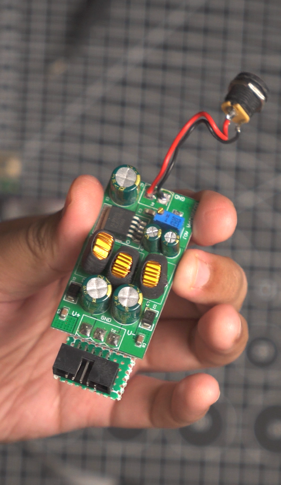

# DC-to-DC Converter

A simple case for my [DC-to-DC converter](https://www.aliexpress.com/item/1005005123124867.html) based on [YAPP](https://mrwheel-docs.gitbook.io/yappgenerator_en). This is written in OpenSCAD. Main code is in `DC Conveter Case.scad`.

## The Module

## The Case

